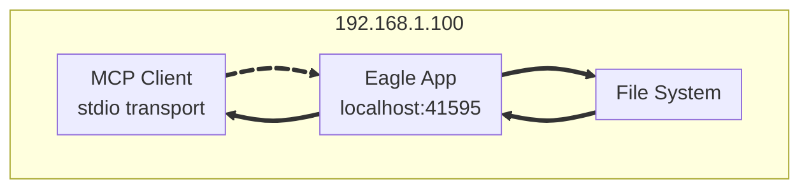

# Eagle MCP Server (Unofficial)


A Model Context Protocol (MCP) server for Eagle. [Wiki](https://github.com/tuki0918/eagle-mcp-server/wiki)

**Now using FastMCP 2.0 with stdio transport for better local usage!**

<details>

<summary>Supported file formats:</summary>

- `JPG` / `JPEG`
- `PNG`
- `PDF`
- `SVG`
- `MP4`
- `MP3`
- `FBX`
- `OBJ`
- `EPS`
- `TIF` / `TIFF`
- `WebP`
- `BMP`
- `ICO`
- `RAW`
- etc

</details>

- Eagle: https://eagle.cool/<br />
- Eagle API docs: https://api.eagle.cool/<br />

## Requirements

- Python 3.13
- [uv](https://docs.astral.sh/uv/)

## Prerequisites

Install the required dependencies:

```bash
uv sync
```

## Usage

1. Launch the [Eagle](https://eagle.cool/) app.
2. Launch this MCP server by running the following command:

```bash
uv run main.py
# To use a different endpoint:
# EAGLE_API_BASE_URL=http://localhost:12345 uv run main.py
```

## Connecting to the MCP Server using stdio

All the most popular MCP clients (Claude Desktop, Cursor & Windsurf) use the following config format for stdio transport:

```json
{
  "mcpServers": {
    "eagle-mcp-server": {
      "command": "uv",
      "args": ["run", "main.py"],
      "cwd": "/path/to/eagle-mcp-server"
    }
  }
}
```

VS Code:

```json
{
  "mcp": {
    "servers": {
      "eagle-mcp-server": {
        "type": "stdio",
        "command": "uv",
        "args": ["run", "main.py"],
        "cwd": "/path/to/eagle-mcp-server"
      }
    }
  }
}
```

## Tools

## Tools

| Tool Name                    | Description                                               | Category    |
|:-----------------------------|:----------------------------------------------------------|:------------|
| `connect`                    | Connect to Eagle MCP Server                              | MCP         |
| `get_application_info`       | Get detailed information on the Eagle App currently running | Application |
| `create_folder`              | Create a folder in the current library                   | Folder      |
| `update_folder`              | Update the specified folder (name, description, color)   | Folder      |
| `get_folder_list`            | Get the list of folders of the current library           | Folder      |
| `add_item_from_path`         | Add an image from a local file path to Eagle App         | Item        |
| `get_item_info`              | Get detailed information about a specific item           | Item        |
| `get_item_source`            | Get the source file information for a specific item      | Item        |
| `get_item_list`              | Get a list of items from the current library             | Item        |
| `move_item_to_trash`         | Move an item to trash                                     | Item        |
| `update_item`                | Update an item's metadata (name, tags, annotation, etc.) | Item        |
| `get_library_info`           | Get information about the current library                | Library     |

All tools are enabled by default and use Eagle's native API endpoints.

**Note:** This version uses stdio transport instead of HTTP/SSE for better local usage and MCP client compatibility.

## Use Cases

### Recommended Setup: Local Usage with stdio transport



> [!TIP]
> This setup uses stdio transport which is the recommended approach for MCP clients.
> You have direct access to the filesystem and Eagle App on the same machine.

**Benefits:**
- Direct stdio communication (no HTTP server needed)
- Better security (no network exposure)
- Faster communication
- Native MCP protocol support
- Easy to configure in MCP clients
