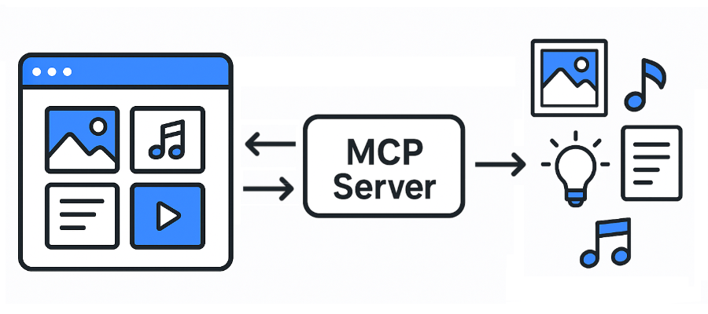
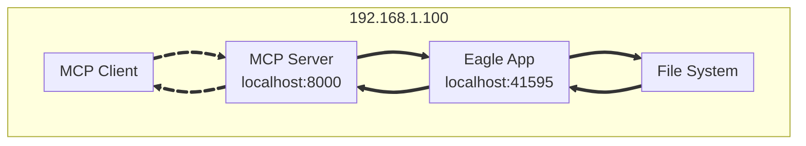

# Eagle MCP Server (Unofficial)



A Model Context Protocol (MCP) server for Eagle. [Wiki](https://github.com/tuki0918/eagle-mcp-server/wiki)

<details>

<summary>Supported file formats:</summary>

- `JPG` / `JPEG`
- `PNG`
- `PDF`
- `SVG`
- `MP4`
- `MP3`
- `FBX`
- `OBJ`
- `EPS`
- `TIF` / `TIFF`
- `WebP`
- `BMP`
- `ICO`
- `RAW`
- etc

</details>

- Eagle: https://eagle.cool/<br />
- Eagle API docs: https://api.eagle.cool/<br />

## Requirements

- Python 3.13
- [uv](https://docs.astral.sh/uv/)

## Prerequisites

Install the required dependencies:

```bash
uv sync
```

## Usage

1. Launch the [Eagle](https://eagle.cool/) app.
2. Launch this MCP server by running the following command:

```bash
uv run main.py
# To use a different endpoint:
# EAGLE_API_BASE_URL=http://localhost:12345 uv run main.py
```


## Connecting to the MCP Server using SSE

All the most popular MCP clients (Claude Desktop, Cursor & Windsurf) use the following config format:

```
{
  "mcpServers": {
    "eagle-mcp-server": {
      "url": "http://localhost:8000/mcp"
    }
  }
}
```

VS Code

```
"mcp": {
    "servers": {
        "eagle-mcp-server": {
            "type": "sse",
            "url": "http://localhost:8000/mcp"
        }
    }
}
```

## Tools

| Supported | Operation ID             | API endpoint               | Enabled (default) | Category    |
|:----:|:-------------------------|:---------------------------|:----:|:------------|
| ✅ | `connect`                | /api/connect               |  | MCP         |
| ✅ | `get_application_info`   | /api/application/info      | ⚫︎ | Application |
| ✅ | `create_folder`          | /api/folder/create         | ⚫︎ | Folder      |
| ✅ | `rename_folder`          | /api/folder/rename         |  | Folder      |
| ✅ | `update_folder`          | /api/folder/update         | ⚫︎ | Folder      |
| ✅ | `get_folder_list`        | /api/folder/list           | ⚫︎ | Folder      |
| ✅ | `get_folder_list_recent` | /api/folder/listRecent     |  | Folder      |
| ✅ | `add_item_from_url`      | /api/item/addFromURL       |  | Item        |
| ✅ | `add_items_from_urls`    | /api/item/addFromURLs      |  | Item        |
| ✅ | `add_item_from_path`     | /api/item/addFromPath      | ⚫︎ | Item        |
| ✅ | `add_items_from_paths`   | /api/item/addFromPaths     |  | Item        |
| ✅ | `add_bookmark`           | /api/item/addBookmark      |  | Item        |
| ✅ | `get_item_info`          | /api/item/info             | ⚫︎ | Item        |
| ✅ | `get_item_source`        | /api/item/source           | ⚫︎ | Item        |
| ✅ | `get_item_thumbnail`     | /api/item/thumbnail        |  | Item        |
| ✅ | `get_item_list`          | /api/item/list             | ⚫︎ | Item        |
| ✅ | `move_item_to_trash`     | /api/item/moveToTrash      | ⚫︎ | Item        |
| ✅ | `refresh_item_palette`   | /api/item/refreshPalette   |  | Item        |
| ✅ | `refresh_item_thumbnail` | /api/item/refreshThumbnail |  | Item        |
| ✅ | `update_item`            | /api/item/update           | ⚫︎ | Item        |
| ✅ | `get_library_info`       | /api/library/info          | ⚫︎ | Library     |
| ✅ | `get_library_history`    | /api/library/history       |  | Library     |
| ✅ | `switch_library`         | /api/library/switch        |  | Library     |
| ✅ | `get_library_icon`       | /api/library/icon          |  | Library     |
| [ ] | ...                      | ...                        |  | ...         |

MCP Server API docs: 
- https://tuki0918.github.io/eagle-mcp-server/
- http://localhost:8000/redoc

## Use Cases

### 1) Same Host (Recommended)



> [!TIP]
> You have direct access to the filesystem.

### 2) Same Host (Eagle App, MCP Server) + Other Host (MCP Client)


> [!WARNING]
> You don't have access to the filesystem.

### 3) Other Host


> [!WARNING]
> You don't have access to the filesystem.
