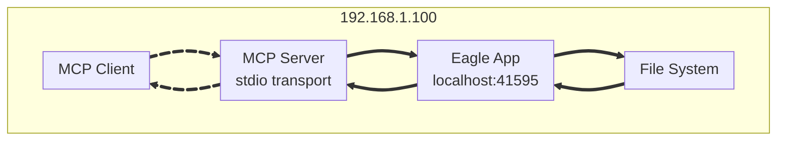

# Eagle MCP Server (Unofficial)


A Model Context Protocol (MCP) server for Eagle. [Wiki](https://github.com/tuki0918/eagle-mcp-server/wiki)

<details>

<summary>Supported file formats:</summary>

- `JPG` / `JPEG`
- `PNG`
- `PDF`
- `SVG`
- `MP4`
- `MP3`
- `FBX`
- `OBJ`
- `EPS`
- `TIF` / `TIFF`
- `WebP`
- `BMP`
- `ICO`
- `RAW`
- etc

</details>

- Eagle: https://eagle.cool/<br />
- Eagle API docs: https://api.eagle.cool/<br />

## Requirements

- Python 3.13
- [uv](https://docs.astral.sh/uv/)

## Prerequisites

Install the required dependencies:

```bash
uv sync
```

## Usage

1. Launch the [Eagle](https://eagle.cool/) app.
2. Launch this MCP server by running the following command:

```bash
uv run main.py
# To use a different endpoint:
# EAGLE_API_BASE_URL=http://localhost:12345 uv run main.py
```


## Connecting to the MCP Server

This server uses **stdio transport** (recommended for local usage). Configure your MCP client as follows:

### Claude Desktop

```json
{
  "mcpServers": {
    "eagle-mcp-server": {
      "command": "uv",
      "args": ["run", "main.py"],
      "cwd": "/path/to/eagle-mcp-server"
    }
  }
}
```

### VS Code

```json
{
  "mcp": {
    "servers": {
      "eagle-mcp-server": {
        "type": "stdio",
        "command": "uv",
        "args": ["run", "main.py"],
        "cwd": "/path/to/eagle-mcp-server"
      }
    }
  }
}
```

### Environment Variables

- `EAGLE_API_BASE_URL` - Eagle API endpoint (default: `http://localhost:41595`)

Example:
```bash
EAGLE_API_BASE_URL=http://localhost:12345 uv run main.py
```

## Tools

| Supported | Operation ID             | API endpoint               | Available | Category    |
|:----:|:-------------------------|:---------------------------|:----:|:------------|
| ✅ | `get_application_info`   | /api/application/info      | ✅ | Application |
| ✅ | `create_folder`          | /api/folder/create         | ✅ | Folder      |
| ✅ | `rename_folder`          | /api/folder/rename         | ✅ | Folder      |
| ✅ | `update_folder`          | /api/folder/update         | ✅ | Folder      |
| ✅ | `get_folder_list`        | /api/folder/list           | ✅ | Folder      |
| ✅ | `get_folder_list_recent` | /api/folder/listRecent     | ✅ | Folder      |
| ✅ | `add_item_from_url`      | /api/item/addFromURL       | ✅ | Item        |
| ✅ | `add_items_from_urls`    | /api/item/addFromURLs      | ✅ | Item        |
| ✅ | `add_item_from_path`     | /api/item/addFromPath      | ✅ | Item        |
| ✅ | `add_items_from_paths`   | /api/item/addFromPaths     | ✅ | Item        |
| ✅ | `add_bookmark`           | /api/item/addBookmark      | ✅ | Item        |
| ✅ | `get_item_info`          | /api/item/info             | ✅ | Item        |
| ✅ | `get_item_source`        | /api/item/source           | ✅ | Item        |
| ✅ | `get_item_thumbnail`     | /api/item/thumbnail        | ✅ | Item        |
| ✅ | `get_item_list`          | /api/item/list             | ✅ | Item        |
| ✅ | `move_item_to_trash`     | /api/item/moveToTrash      | ✅ | Item        |
| ✅ | `refresh_item_palette`   | /api/item/refreshPalette   | ✅ | Item        |
| ✅ | `refresh_item_thumbnail` | /api/item/refreshThumbnail | ✅ | Item        |
| ✅ | `update_item`            | /api/item/update           | ✅ | Item        |
| ✅ | `get_library_info`       | /api/library/info          | ✅ | Library     |
| ✅ | `get_library_history`    | /api/library/history       | ✅ | Library     |
| ✅ | `switch_library`         | /api/library/switch        | ✅ | Library     |
| ✅ | `get_library_icon`       | /api/library/icon          | ✅ | Library     |

**Total: 19 tools available**

All tools are now available by default in the FastMCP implementation. Previously disabled endpoints have been enabled.

## Use Cases

### 1) Same Host (Recommended)



> [!TIP]
> Using stdio transport - no network ports required. You have direct access to the filesystem.

### 2) Remote Usage

For remote usage, you would need to run the MCP server on the same machine as Eagle and configure your client to connect remotely. However, stdio transport requires local execution, so this setup is more complex and not recommended.
